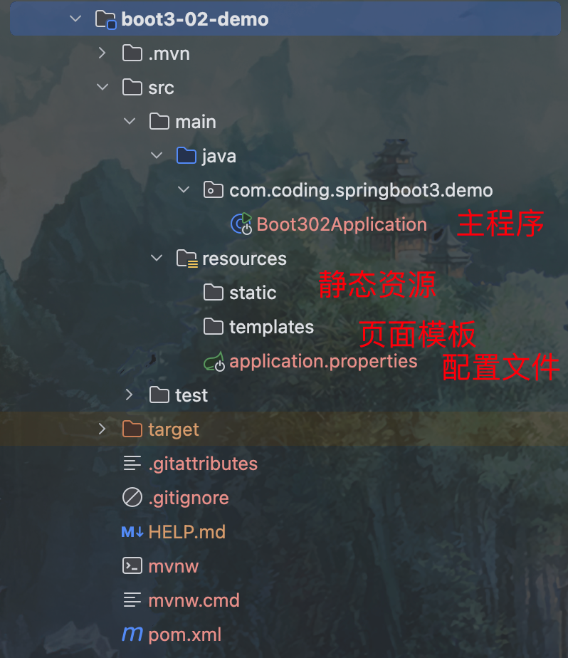

# backend-springboot3-learning

[TOC]

SpringBoot3进度：

https://www.bilibili.com/video/BV1Es4y1q7Bf?spm_id_from=333.788.player.switch&vd_source=b850b3a29a70c8eb888ce7dff776a5d1&p=6


笔记：https://www.yuque.com/leifengyang/springboot3

代码：https://gitee.com/leifengyang/spring-boot-3

响应式编程进度：

https://www.bilibili.com/video/BV1sC4y1K7ET/?spm_id_from=333.999.0.0&vd_source=b850b3a29a70c8eb888ce7dff776a5d1

# SpringBoot3核心特性篇

# 第1章 SpringBoot3快速入门

## 1.1 简介

### 1.1.1 前置知识

- Java17
- Spring、SpringMVC、MyBatis
- Maven
- IDEA

### 1.1.2 环境要求

[System Requirements](https://docs.spring.io/spring-boot/system-requirements.html)

- Spring6.2.1+
- SpringBoot3.4.1+

- IntelliJ IDEA 2024.3.1.1

- Java17+ 至 Java23
- Maven3.6.3+
- Tomcat 10.1 (10.1.25 or later）
- Servlet 5.0+

### 1.1.3 SpringBoot是什么

SpringBoot帮我们简单、快速地创建一个独立的、生产级别的Spring应用（说明：SpringBoot底层是Spring）。

大多数SpringBoot应用只需要编写少量配置即可快速整合Spring平台以及第三方技术。

**特性：**

- <span style="color:red;font-weight:bold;">快速创建</span>独立Spring应用。
- 直接<span style="color:red;font-weight:bold;">嵌入</span>Tomcat、Jetty or Undertow（无需部署war包）【Servlet容器】。
- 【重点】提供可选的<span style="color:red;font-weight:bold;">starter（场景启动器）</span>，简化应用整合。
- 【重点】<span style="color:red;font-weight:bold;">按需自动配置</span>Spring以及第三方库。
- 提供<span style="color:red;font-weight:bold;">生产级特性</span>：如 监控指标、健康检查、外部化配置等。
- 无代码生成，<span style="color:red;font-weight:bold;">无xml</span>

总结：简化整合，简化开发，简化配置，简化部署，简化监控，简化运维。

## 1.2 快速体验

> 场景：浏览器发送 / 请求，返回 Hello World!

### 1.2.1 开发流程

**1 创建项目**

Maven项目父pom集成，所有SpringBoot项目都必须继承自 spring-boot-starter-parent

```xml
		<groupId>com.coding.springboot3</groupId>
		<artifactId>boot3-01-demo</artifactId>

		<parent>
        <groupId>org.springframework.boot</groupId>
        <artifactId>spring-boot-starter-parent</artifactId>
        <version>3.4.1</version>
        <relativePath/> <!-- lookup parent from repository -->
    </parent>

    <properties>
        <maven.compiler.source>17</maven.compiler.source>
        <maven.compiler.target>17</maven.compiler.target>
        <project.build.sourceEncoding>UTF-8</project.build.sourceEncoding>
    </properties>
```

**2 导入场景**

场景启动器

```xml
    <dependencies>
        <!-- 定义三方包 beg -->
        <dependency>
            <groupId>org.springframework.boot</groupId>
            <artifactId>spring-boot-starter-web</artifactId>
        </dependency>
        <!-- 定义三方包 end -->
    </dependencies>
```

**3 主程序和业务代码**

```java
@RestController
@SpringBootApplication
public class Boot301Application {

    @RequestMapping("/")
    String home() {
        return "Hello World!";
    }

    public static void main(String[] args) {
        SpringApplication.run(Boot301Application.class, args);
    }

}
```

**4 测试**

默认启动访问： http://localhost:8080/

**5 打包**

```xml
    <build>
      	<finalName>demo</finalName>
        <plugins>
            <plugin>
                <groupId>org.springframework.boot</groupId>
                <artifactId>spring-boot-maven-plugin</artifactId>
            </plugin>
        </plugins>
    </build>
```

- 打包命令

```bash
$ mvn -pl boot3-01-demo -am clean package -Dmaven.test.skip=true
```

- 执行命令

  - 方式一

  ```bash
  $ java -jar boot3-01-demo/target/demo.jar 
  ```

  - 方式二

  ```bash
  $ mvn -pl boot3-01-demo spring-boot:run
  ```

  - 方式三

  直接运行注解`@SpringBootApplication`标注的main方法。

### 1.2.2 特性小结

**1 简化整合**

导入相关的场景启动器，拥有相关的功能。

默认支持的所有场景：https://docs.spring.io/spring-boot/reference/using/build-systems.html#using.build-systems.starters

- 官方提供的场景：命名为`spring-boot-starter-*`
- 第三方提供场景：命名为`thirdpartyproject-spring-boot-starter`

<span style="color:#32CD32;font-weight:bold;">场景一导入，万物皆就绪</span>

**2 简化开发**

无需编写任何配置，直接开发业务。

**3 简化配置**

`application.properties`

- 集中式管理配置。只需要修改这个文件即可。
- 配置基本都有默认值。
- 能写的所有配置都在：https://docs.spring.io/spring-boot/appendix/application-properties/index.html

**4 简化部署**

打包为可执行的jar包。

Linux服务器上有Java环境。

**5 简化监控**

可以通过指标（比如健康检查等指标）监控。

**6 简化运维**

修改配置（外部放一个application.properties文件）。

......

### 1.2.3 Spring Initializr创建向导

Spring Boot向导：


Spring Boot创建好的项目结构：



## 1.3 应用分析

### 1.3.1 依赖管理机制

**1 为什么导入`spring-boot-starter-web`所有相关依赖都导入进来了？**

- 在Spring Boot中，开发什么场景，导入什么场景的启动器即可。比如：开发Web，引入`spring-boot-starter-web`
- maven依赖传递原则。假若A=>B=>C，则A就拥有B和C。
- 导入场景启动器。场景启动器自动把这个场景的所有核心依赖全部导入进来。

**2 为什么版本号都不需要写？**

- 每个boot项目都有一个父项目`spring-boot-starter-parent`
- parent的父项目是`spring-boot-dependencies`
- 父项目**版本仲裁中心**，把所有场景的jar的依赖版本都声明好了。
- 比如：`mysql-connector-j`

**3 自定义版本号**

- 利用maven的就近原则

  - 直接在当前项目`properties`标签中声明父项目用的版本属性的key。

    ```xml
        <properties>
            <mysql.version>9.1.0</mysql.version>
        </properties>
    ```

  - 直接在**导入依赖的时候声明版本**

    ```xml
        <dependencies>
            <dependency>
                <groupId>com.mysql</groupId>
                <artifactId>mysql-connector-j</artifactId>
                <version>${mysql.version}</version>
            </dependency>
    	  </dependencies>
    ```

**4 第三方的jar包**

- boot父项目没有管理的需要自行声明

```xml
<!-- https://mvnrepository.com/artifact/com.alibaba/druid -->
<dependency>
    <groupId>com.alibaba</groupId>
    <artifactId>druid</artifactId>
    <version>1.2.16</version>
</dependency>
```


### 1.3.2 自动配置机制

**1 初步理解**

- **自动配置**的 Tomcat、SpringMVC等

  - **导入场景**，容器中就会自动配置好这个场景的核心组件。
  - 以前：DispatcherServlet、ViewResolver、CharacterEncodingFilter......
  - 现在：自动配置好的这些组件
  - 验证：**容器中有了什么组件，就具有什么功能**

  ```java
      public static void main(String[] args) {
          // java10: 局部变量类型的自动推断
          var ioc = SpringApplication.run(Boot302Application.class, args);
  
          // 1 获取容器中所有组件的名字
          var names = ioc.getBeanDefinitionNames();
          // 2 挨个遍历
          // SpringBoot把以前配置的核心组件现在都给我们自动配置好了，比如：dispatcherServlet、beanNameViewResolver、characterEncodingFilter、multipartResolver
          for (String name : names) {
              System.out.println(name);
          }
      }
  
  ```

- 默认的包扫描规则
  - `@SpringBootApplication`标注的类就是主程序类
  - **SpringBoot只会扫描主程序所在的包及其下面的子包，自动的component-scan功能**
  - **自定义扫描路径**
    - `@SpringBootApplication(scanBasePackages="com.coding")`
    - `@ComponentScan("com.coding")`直接指定扫描的路径。
- **配置默认值**
  - **配置文件**的所有配置项是和某个**类的对象**值进行一一绑定的。
  - 绑定了配置文件中每一项值的类：**属性类**
  - 比如：
    - `ServerProperties`绑定了所有Tomcat服务器有关的配置
    - `MultipartProperties`绑定了所有文件上传相关的配置
    - ......参照[官方文档](https://docs.spring.io/spring-boot/appendix/application-properties/index.html)：或者参照绑定的**属性类**

-  按需加载自动配置
  - 导入场景`spring-boot-starter-web`
  - 场景启动器除了会导入相关功能依赖，导入一个`spring-boot-starter`，是所有`starter`的`starter`，基础核心starter
  - `spring-boot-starter`导入了一个包`spring-boot-autoconfigure`。包里面都是各种场景的`AutoConfiguration`**自动配置类**
  - 虽然全场景的自动配置都在`spring-boot-autoconfigure`这个包，但是不是全部都开启的。
    - 导入哪个场景就开启哪个自动配置。

总结：导入场景启动器、触发`spring-boot-autoconfigure`这个包的自动配置生效、容器中就会具有相关场景的功能。


**2 完整流程**

> 思考：
>
> 1、<span style="color:red;font-weight:bold;">SpringBoot怎么实现导入一个`starter`、写一些简单配置，应用就能跑起来，让我们无需关心整合。</span>
>
> 2、为什么Tomcat的端口号可以配置在`application.properties`中，并且`Tomcat`能启动成功？
>
> 3、导入场景后哪些**自动配置能生效**？


**自动配置流程细节梳理：**

1. 导入`spring-boot-starter-web`：导入了web开发场景
   1. 场景启动器导入了相关场景的所有依赖：
      - `spring-boot-starter-json`
      - `spring-boot-starter-tomcat`
      - `spring-web`
      - `spring-webmvc`
   2. 每个场景启动器都引入了一个`spring-boot-starter`，核心场景启动器。
   3. **核心场景启动器**引入了`spring-boot-autoconfigure`包。
   4. `spring-boot-autoconfigure`里面囊括了所有场景的所有配置。
   5. 只要这个包下的所有类都能生效，那么相当于SpringBoot官方写好的整合功能就生效了。
   6. SpringBoot默认却扫描不到`spring-boot-autoconfigure`下写好的所有**配置类**。（这些**配置类**给我们做了整合操作），**默认只扫描主程序所在的包**。
2. **主程序**：`@SpringBootApplication`
   1. `@SpringBootApplication`由三个注解组成`@SpringBootConfiguration`、`@EnableAutoConfiguration`和`@ComponentScan`。
   2. SpringBoot默认只能扫描自己主程序所在的包及其下面的子包，扫描不到`spring-boot-autoconfigure`包中官方写好的**配置类**。
   3. `@EnableAutoConfiguration`：SpringBoot**开启自动配置的核心**。
      1. 是由`@Import({AutoConfigurationImportSelector.class})`提供功能：批量给容器中导入组件。
      2. SpringBoot启动会默认加载`153`个配置类。
      3. 这**153个配置类**来自于`spring-boot-autoconfigure`下`META-INF/spring/org.springframework.boot.autoconfigure.AutoConfiguration.imports`包下的153个`xxxxAutoConfiguration`类导入进来（**自动配置类**）。
   4. 按需生效：
      1. 虽然导入了`153`个自动配置类，并不是这`153`个自动配置类都能生效。
      2. 每一个自动配置类，都有条件注解`@ConditionalOnxxx`，只有条件成立，才能生效。
3. **`xxxxAutoConfiguration`自动配置类**
   1. **给容器中使用@Bean放一堆组件。**
   2. 每个**自动配置类**都可能有这个注解`@EnableConfigurationProperties(ServerProperties.class)`，用来把配置文件中配的指定前缀的属性封装到`XXXXProperties`属性类中。
   3. 以Tomcat为例：把服务器的所有配置都是以`server`开头的。配置都封装到了属性类中。
   4. 给**容器**中放的所有**组件**的一些**核心参数**，都来自于**`XXXXProperties`**。**`XXXXProperties`都是和配置文件绑定。**
   5. **只需要修改配置文件的值，核心组件的底层参数都能修改。**
4. 写业务，全程无需关心各种整合（底层这些整合写好了，而且也生效了）

<span style="color:red;font-weight:bold;">核心流程总结：</span>

1. 导入`starter`，就会导入`autoconfigure`包。
2. `autoconfigure`包里面有一个文件`META-INF/spring/org.springframework.boot.autoconfigure.AutoConfiguration.imports`，里面指定的所有启动要加载的自动配置类。
3. `@EanbleAutoConfiguration`会自动的把上面文件里面写的所有**自动配置类都导入进来。XXXXAutoConfiguration是有条件注解进行按需加载**。
4. `XXXXAutoConfiguration`给容器中导入一堆组件，组件都是从`XXXXProperties`中提取属性值。
5. `XXXXProperties`又是和**配置文件**进行了绑定。

**效果：**导入`starter`、修改配置文件，就能修改底层行为。


**3 如何学好SpringBoot**

框架的框架、底层基于Spring。能调整每一个场景的底层行为。100%项目一定会用到**底层自定义**。

以摄影为例：

- 傻瓜（SpringBoot）：自动配置好。
- **单反**（Spring）：焦距、光圈、快门、感光度......
- 傻瓜+**单反**：

1. 理解**自动配置原理**

   a. 导入starter ==> 生效xxxxAutoConfiguration ==> 组件 ==> xxxxProperties ==> 配置文件

2. 理解**其他框架底层**

   a. 拦截器

3. 可以随时**定制化任何组件**

   a. 配置文件

   b. 自定义组件

普通开发：`导入starter`，Controller、Service、Mapper、偶尔修改配置文件

**高级开发**：自定义组件、自定义配置、自定义starter

核心：

- 这个场景自动配置导入了哪些组件，我们能不能Autowired进来使用
- 能不能通过修改配置改变组件的一些默认参数
- 需不需要自己完全定义这个组件
- <span style="color:red;font-weight:bold;">场景定制化</span>

<span style="color:red;font-weight:bold;">最佳实战：</span>

- <span style="color:red;font-weight:bold;">选场景，导入到项目</span>
  - <span style="color:red;">官方：starter</span>
  - <span style="color:red;">第三方：去仓库搜</span>
- <span style="color:red;font-weight:bold;">写配置，改配置文件关键项</span>
  - <span style="color:red;">数据库参数（连接地址、账号密码......）</span>
- <span style="color:red;">分析这个场景给我们导入了</span><span style="color:red;font-weight:bold;">那些能用的组件</span>
  - <span style="color:red;font-weight:bold;">自动装配</span><span style="color:red;">这些组件进行后续使用</span>
  - <span style="color:red;">不满意boot提供的自动配好的默认组件</span>
    - <span style="color:red;font-weight:bold;">定制化</span>
      - <span style="color:red;">改配置</span>
      - <span style="color:red;">自定义组件</span>

整合redis：

- <span style="color:#1E90FF;">选场景</span>：`spring-boot-starter-data-redis`
  - 场景AutoConfiguration就是这个场景的自动配置类
- 写配置
  - 分析到这个场景的自动配置类开启了哪些属性绑定关系
  - `@EanbleConfigurationProperties(RedisProperties.class)`
  - 给业务代码中自动装配`StringRedisTemplate`
- 分析组件
  - 分析到`RedisAutoConfiguration`给容器中放了`StringRedisTemplate`
  - 给业务代码中自动装配了`StringRedisTemplate`
- 定制化
  - 修改配置文件
  - 自定义组件，自己给容器中放一个`StringRedisTemplate`

## 1.4 核心技能

### 1.4.1 常用注解

> SpringBoot摒弃XML配置方式，改为**全注解驱动**

**1 组件注册**

@Configuration、@SpringBootConfiguration

@Bean、@Scope

@Controller、@Service、@Repository、@Component

@Import

@ComponentScan

步骤：

1、@Configuration编写一个配置类

2、在配置类中，自定义方法给容器中注册组件。配置@Bean

3、或使用@Import导入第三方的组件


**2 条件注解**

> 如果注解指定的**条件成立**，则触发指定行为。

<span style="color:#FF00FF;font-weight:bold;">@ConditionalOnXXXX</span>

<span style="color:#9400D3;font-weight:bold;">@ConditionalOnClass：如果类路径中存在这个类，则触发指定行为</span>

<span style="color:#9400D3;font-weight:bold;">@ConditionalOnMissingClass：如果类路径中不存在这个类，则触发指定行为</span>

<span style="color:#9400D3;font-weight:bold;">@ConditionalOnBean：如果容器中存在这个Bean（组件），则触发指定行为</span>

<span style="color:#9400D3;font-weight:bold;">@ConditionalOnMissingBean：如果容器中不存在这个Bean（组件），则触发指定行为</span>

> 场景：
>
> - 如果存在`FastsqlException`这个类，给容器中放一个`Cat`组件，名cat01，
> - 否则，就给容器中放一个`Dog`组件，名为dog01
> - 如果系统中有`dog01`这个组件，就给容器中放一个User组件，名为zhangsan
> - 否则，就放一个User，名叫lisi

<span style="color:#9400D3;font-weight:bold;">@ConditionalOnBean(value=组件类型，name=组件名字)：判断容器中是否有这个类型的组件，并且名字是指定的值</span>

@ConditionalOnRepositoryType (org.springframework.boot.autoconfigure.data)
@ConditionalOnDefaultWebSecurity (org.springframework.boot.autoconfigure.security)
@ConditionalOnSingleCandidate (org.springframework.boot.autoconfigure.condition)
@ConditionalOnWebApplication (org.springframework.boot.autoconfigure.condition)
@ConditionalOnWarDeployment (org.springframework.boot.autoconfigure.condition)
@ConditionalOnJndi (org.springframework.boot.autoconfigure.condition)
@ConditionalOnResource (org.springframework.boot.autoconfigure.condition)
@ConditionalOnExpression (org.springframework.boot.autoconfigure.condition)
<span style="color:#9400D3;font-weight:bold;">@ConditionalOnClass</span> (org.springframework.boot.autoconfigure.condition)
@ConditionalOnEnabledResourceChain (org.springframework.boot.autoconfigure.web)
<span style="color:#9400D3;font-weight:bold;">@ConditionalOnMissingClass</span> (org.springframework.boot.autoconfigure.condition)
@ConditionalOnNotWebApplication (org.springframework.boot.autoconfigure.condition)
@ConditionalOnProperty (org.springframework.boot.autoconfigure.condition)
@ConditionalOnCloudPlatform (org.springframework.boot.autoconfigure.condition)
<span style="color:#9400D3;font-weight:bold;">@ConditionalOnBean</span> (org.springframework.boot.autoconfigure.condition)
<span style="color:#9400D3;font-weight:bold;">@ConditionalOnMissingBean</span> (org.springframework.boot.autoconfigure.condition)
@ConditionalOnMissingFilterBean (org.springframework.boot.autoconfigure.web.servlet)
@Profile (org.springframework.context.annotation)
@ConditionalOnInitializedRestarter (org.springframework.boot.devtools.restart)
@ConditionalOnGraphQlSchema (org.springframework.boot.autoconfigure.graphql)
@ConditionalOnJava (org.springframework.boot.autoconfigure.condition)


**3 属性绑定**

<span style="color:#9400D3;font-weight:bold;">@ConfigurationProperties：声明组件的属性和配置文件哪些前缀开始项进行绑定</span>

<span style="color:#9400D3;font-weight:bold;">@EnableConfigurationProperties：快速注册注解</span>

- <span style="color:#9400D3;font-weight:bold;">场景：</span>SpringBoot默认只扫描自己主程序所在的包。如果导入第三方包，即使组件上标注了@Component、@ConfigurationProperties注解，也没用。因为组件都扫描不进来，此时使用这个注解就可以快速进行属性绑定并把组件注册进容器。

> 将容器中任意**组件（Bean）的属性值和配置文件**的配置项的值**进行绑定**
>
> - 1、给容器中注册组件（@Component、@Bean）
> - 2、<span style="color:#9400D3;font-weight:bold;">@ConfigurationProperties声明组件和配置文件的哪些配置项进行绑定</span>

更多注解参照：[Spring注解驱动开发](https://www.bilibili.com/video/BV1gW411W7wy)【1-26集】

### 1.4.2 YAML配置文件

> 痛点：SpringBoot集中化管理配置，`application.properties`
>
> 问题：配置多以后难阅读和修改，**层级结构辨识度不高。**

> YAML是“YAML Ain't a Markup Language”（YAML不是一种标记语言）。
>
> 在开发的这种语言时，YAML的意思其实是：“Yet Another Markup Language”（是另一种标记语言）。
>
> - 设计目标，就是**方便人类读写。**
> - **层次分明**，更适合做配置文件。
> - 使用`.yaml`或`.yml`作为文件后缀。

**1 基本语法**

- **大小写敏感**
- 使用**缩进表示层级关系，`k: v`，使用空格分隔k和v。**
- 缩进时不允许使用Tab键，只允许**使用空格**、换行。
- 缩进的空格数目不重要，只要**相同层级**的元素**左侧对齐**即可。
- **# 表示注释**，从这个字符一直到行尾，都会被解析器忽略。

支持的写法：

- **对象：键值对**的集合，如：映射（map）/哈希（hash）/字典（dictionary）
- **数组**：一组按次序排列的值，如：序列（sequence）/列表（list）
- **纯量**：单个的、不可再分的值，如：字符串、数字、bool、日期


**2 示例**

```java
@Data
@Component
@ConfigurationProperties(prefix = "person")
public class Person {
    private String name;
    private int age;
    private Date birthday;
    private Boolean like;
    private Child child; // 嵌套对象
    private List<Dog> dogs; // 数字（里面是对象）
    private Map<String, Cat> cats; // 表示Map
}

@Data
public class Child {
    private String name;
    private int age;
    private Date birthday;
    private List<String> text; // 文本字符串
}

@Data
public class Cat {
    private Long id;
    private String name;
    private Integer age;
}

@Data
public class Dog {
    private Long id;
    private String name;
    private Integer age;
}
```

- properties表示法

```properties
person.name=张三
person.age=18
person.birthday=2010/10/12 12:12:12
person.like=true
person.child.name=李四
person.child.age=12
person.child.birthday=2018/10/12
person.child.text[0]=abc
person.child.text[1]=def
person.dogs[0].name=小黑
person.dogs[0].age=3
person.dogs[1].name=小白
person.dogs[1].age=2
person.cats.c1.name=小蓝
person.cats.c1.age=3
person.cats.c2.name=小灰
person.cats.c2.age=2
```

- yaml表示法

```yaml
person:
  name: 张三
  age: 18
  birthday: 2010/10/12 12:12:12
  like: true
  child:
    name: 李四
    age: 20
    birthday: 2018/10/12
    #    text: ["abc", "def"]
    text:
      - abc
      - def
  dogs:
    - name: 小黑
      age: 3
    - name: 小白
      age: 2
  cats:
    c1:
      name: 小蓝
      age: 2
    c2: { name: 小绿, age: 2 }
```


**3 细节**

- 若是小驼峰命名的变量，比如：birthDay，推荐写为 birth-day

- **文本**：

  - **单引号**不会转义【\n则为普通字符串显示】
  - **双引号**会转义【\n会显示为换行符】

- **大文本**

  - `|`开头，大文本写在下层，**保留文本格式，换行符正确显示。**

  - `>`开头，大文本写在下层，折叠换行符。

    > <span style="color:red;font-weight:bold;">注意：若多行文本，行与行之间没有缩进，则会把\n变成空格；否则会保留格式。</span>

    

- **多文档合并**
  - 使用`---`可以把多个yaml文档合并在一个文档中，每个文档区依然认为内容独立。

**4 小技巧：lombok**

```pom
        <dependency>
            <groupId>org.projectlombok</groupId>
            <artifactId>lombok</artifactId>
            <scope>compile</scope>
        </dependency>
```

使用`@Data`等注解。

### 1.4.3 日志配置

> 规范：项目开发不要编写`System.out.println()`，应该用**日志**记录信息。

- 日志门面
  - JCL（Jakarta Commons Logging）
  - <span style="color:red;font-weight:bold;">SLF4j（Simple Logging Facade for Java）</span>
  - jboss-logging
- 日志实现
  - Log4j
  - JUL（java.util.logging）
  - Log4j2
  - <span style="color:red;font-weight:bold;">Logback</span>

<span style="color:red;font-weight:bold;">感兴趣日志框架关系与起源可参考：</span>ww.bilibili.com/video/BV1gW411W76m 视频21~27集

**1 简介**

1. Spring使用猩红<span style="color:red;">commons-logging`</span>作为内部日志，但底层日志实现是开放的。可对接其他日志框架。
   1. Spring5及以后commongs-logging被Spring直接自己写。
2. 支持<span style="color:red;">`jul`</span>，<span style="color:red;">`log4j2`</span>，<span style="color:red;">`logback`</span>。SpringBoot提供了默认的控制台输出配置，也可以配置输出位文件。
3. <span style="color:red;">`logback`</span>是默认使用的。
4. 虽然**日志框架很多**，但是我们不用担心，使用SpringBoot的**默认配置就能工作的很好**。                                                                                                                                                                                                                                                                                                                                                                                                                                                                                                                                                                                                                                                                                                                                                                                                                                                                                                                                                                                                                                                                                                                                                                                                                                                                                                                                                                                                                                                                                                                                                                                                                                                                                                                                                                                                                                                                                                                                                                                                                                                                                                                                                                                                                                                                                                                                                                                                                                                                                                                                                                                                                                                                                                                                                                                                                                                                                                                                                                                                                                                                                                                                                                                                                                                                                                                                                                                                                                                                                                                                                                                                                                                                                                                                                                                                                                                                                                                                                              

**SpringBoot怎么把日志默认配置好的**

1. 每个`starter`场景，都会导入一个核心场景`spring-boot-starter`
2. 核心场景引入了日志的所有功能`spring-boot-starter-logging`
3. 默认使用了`logback + slf4j`组合作为默认底层日志
4. `日志是系统一启动就要用`，`xxxxAutoConfiguration`是系统启动好了以后放好的组件，后来用的。
5. 日志是利用**监听器机制**配置好的。`ApplicationListener`。
6. 日志所有的配置都可以通过修改配置文件实现。以`logging`开始的所有配置。

**2 日志格式**

```shell
2025-01-29T12:08:51.210+08:00  INFO 77755 --- [boot3-02-demo] [           main] c.c.springboot3.demo.Boot302Application  : Starting Boot302Application using Java 17.0.12 with PID 77755 (/Users/wenqiu/IdeaProjects/backend-spring-learning/spring-boot-3.x/boot3-02-demo/target/classes started by wenqiu in /Users/wenqiu/IdeaProjects/backend-spring-learning)
2025-01-29T12:08:51.211+08:00  INFO 77755 --- [boot3-02-demo] [           main] c.c.springboot3.demo.Boot302Application  : No active profile set, falling back to 1 default profile: "default"
```

默认格式示例输出：

- 时间和日期：毫秒级精度。`2025-01-29T12:08:51.210+08:00`
- 日志级别：<span style="color:red;">`ERROR`</span>、<span style="color:red;">`WARN`</span>、<span style="color:red;">`INFO`</span>、<span style="color:red;">`DEBUG`</span> or <span style="color:red;">`TRACE`</span>。`INFO`
- 进程ID：`77755`
- --- ：消息分隔符
- 应用程序名称：使用[]包含。`boot-03-demo`
- 应用程序组：`无`
- 线程名：`main`
- 日志记录器Logger名：通常是产生日志的**类名**。`c.c.springboot3.demo.Boot302Application`
- 日志消息：日志记录的内容。`Starting Boot302Application using Java 17.0.12 with PID 77755 `

默认值：参照`spring-boot`包`additional-spring-configuration-metadata.json`文件

默认输出格式：参照`spring-boot`包`defaults.xml`文件

```shell
${CONSOLE_LOG_PATTERN:-%clr(%d{${LOG_DATEFORMAT_PATTERN:-yyyy-MM-dd'T'HH:mm:ss.SSSXXX}}){faint} %clr(${LOG_LEVEL_PATTERN:-%5p}){} %clr(${PID:-}){magenta} %clr(--- %esb(){APPLICATION_NAME}%esb{APPLICATION_GROUP}[%15.15t] ${LOG_CORRELATION_PATTERN:-}){faint}%clr(%-40.40logger{39}){cyan} %clr(:){faint} %m%n${LOG_EXCEPTION_CONVERSION_WORD:-%wEx}}
```

**逐段解析**

1. **`%clr(...){color}`**
   - 这是 Spring Boot 提供的日志着色功能，用于为日志内容添加颜色。
   - `%clr(...)` 表示对括号内的内容进行着色。
   - `{color}` 指定颜色，例如 `faint`（浅色）、`magenta`（洋红色）、`cyan`（青色）等。
2. **`%d{${LOG_DATEFORMAT_PATTERN:-yyyy-MM-dd'T'HH:mm:ss.SSSXXX}}`**
   - 定义日志的时间戳格式。
   - `%d` 表示日期时间。
   - `${LOG_DATEFORMAT_PATTERN:-yyyy-MM-dd'T'HH:mm:ss.SSSXXX}` 是一个默认值表达式：
     - 如果 `LOG_DATEFORMAT_PATTERN` 有定义，则使用它的值。
     - 如果未定义，则使用默认格式 `yyyy-MM-dd'T'HH:mm:ss.SSSXXX`（ISO 8601 格式）。
3. **`%clr(${LOG_LEVEL_PATTERN:-%5p}){}`**
   - 定义日志级别的输出格式。
   - `${LOG_LEVEL_PATTERN:-%5p}` 表示：
     - 如果 `LOG_LEVEL_PATTERN` 有定义，则使用它的值。
     - 如果未定义，则使用默认格式 `%5p`（日志级别，右对齐，宽度为 5）。
   - `%clr(...){}` 表示对日志级别进行着色，但未指定颜色（使用默认颜色）。
4. **`%clr(${PID:-}){magenta}`**
   - 输出当前进程的 PID（进程 ID）。
   - `${PID:-}` 表示：
     - 如果 `PID` 有定义，则使用它的值。
     - 如果未定义，则输出空字符串。
   - `{magenta}` 表示将 PID 着色为洋红色。
5. **`%clr(--- %esb(){APPLICATION_NAME}%esb{APPLICATION_GROUP}[%15.15t] ${LOG_CORRELATION_PATTERN:-}){faint}`**
   - 输出应用程序名称、应用程序组、线程名和关联信息（如 `traceId`）。
   - `%esb(){APPLICATION_NAME}` 和 `%esb{APPLICATION_GROUP}` 是自定义的占位符，用于输出应用程序名称和组。
   - `[%15.15t]` 表示线程名，限制为 15 个字符，超过部分截断。
   - `${LOG_CORRELATION_PATTERN:-}` 表示：
     - 如果 `LOG_CORRELATION_PATTERN` 有定义，则使用它的值。
     - 如果未定义，则输出空字符串。
   - `{faint}` 表示将这部分内容着色为浅色。
6. **`%clr(%-40.40logger{39}){cyan}`**
   - 输出日志记录器的名称。
   - `%-40.40logger{39}` 表示：
     - `logger{39}` 输出日志记录器的名称，最多 39 个字符。
     - `%-40.40` 表示左对齐，总宽度为 40 个字符，超过部分截断。
   - `{cyan}` 表示将日志记录器名称着色为青色。
7. **`%clr(:){faint}`**
   - 输出一个冒号 `:`，并着色为浅色。
8. **`%m%n`**
   - `%m` 表示日志消息。
   - `%n` 表示换行符。
9. **`${LOG_EXCEPTION_CONVERSION_WORD:-%wEx}`**
   - 定义异常信息的输出格式。
   - `${LOG_EXCEPTION_CONVERSION_WORD:-%wEx}` 表示：
     - 如果 `LOG_EXCEPTION_CONVERSION_WORD` 有定义，则使用它的值。
     - 如果未定义，则使用默认格式 `%wEx`（输出异常堆栈信息）。

<span style="color:red;font-weight:bold;">简化日志输出格式：</span>`%d{yyyy-MM-dd HH:mm:ss.SSS} %-5level [%thread] %logger{15} ===> %msg%n`

- application.propertie

```properties
logging.pattern.console=%d{yyyy-MM-dd HH:mm:ss.SSS} %-5level [%thread] %logger{15} ===> %msg%n
```

**3 记录日志**

```java
// 或者使用Lombok的@Slf4j注解
Logger logger = LoggerFactory.getLogger(getClass());
```

**4 日志级别**

- 由低到高：<span style="color:red;font-weight:bold;">只会打印指定级别及以上级别的日志</span>
  - ALL：打印所有日志
  - TRACE：追踪框架详细流程日志，一般不用
  - DEBUG：开发调试细节日志
  - INFO：关键、感兴趣的日志信息
  - WARN：警告但不是错误的信息日志，比如：版本过时
  - ERROR：业务错误日志，比如出现各种异常
  - FATAL：致命错误日志，比如JVM系统崩溃
  - OFF：关闭所有日志记录
- 不指定级别的所有类，都使用root指定的级别作为默认级别
- SpringBoot日志**默认级别是INFO**

1. 在<span style="color:red;font-weight:bold;">`application.properties/yaml`</span>中配置<span style="color:red;font-weight:bold;">`logging.level.<logger-name>=<level>`</span>指定日志级别
2. `level`可取值范围：`TRACE, DEBUG, INFO, WARN, ERROR, FATAL, or OFF`，定义在LogLevel类中。
3. root的`logger-name`叫`root`，可以配置`logging.level.root=warn`，代表所有未指定日志级别的类都使用root的warn级别。

**5 日志分组**

比较有用的技巧是：

将相关的`logger`分组在一起，统一配置。SpringBoot也支持。比如：Tomcat相关的日志统一设置。

```properties
logging.group.tomcat=org.apache.catalina,org.apache.coyote,org.apache.tomcat
logging.level.tomcat=trace
```

SpringBoot预定义两个组：

| Name | Loggers                                                      |
| ---- | ------------------------------------------------------------ |
| web  | <span style="color:red;">org.springframework.core.codec</span><br /><span style="color:red;">org.springframework.http</span><br /><span style="color:red;">org.springframework.web</span><br /><span style="color:red;">org.springframework.boot.actuate.endpoint.web</span><span style="color:red;">org.springframework.boot.web.servlet.ServletContextInitializerBeans</span> |
| sql  | <span style="color:red;">org.springframework.jdbc.core</span><br /><span style="color:red;">org.hibernate.SQL</span><br /><span style="color:red;">org.jooq.tools.LoggerListener</span> |

**6 文件输出**

SpringBoot默认只把日志写在控制台，如果想额外记录到文件，可以在<span style="color:red;">application.properties</span>中添加<span style="color:red;">`logging.file.name`</span>or<span style="color:red;">`logging.file.path`</span>配置项。

| <span style="color:red;">`logging.file.name`</span> | <span style="color:red;">`logging.file.path`</span> | 示例     | 效果                                                         |
| --------------------------------------------------- | --------------------------------------------------- | -------- | ------------------------------------------------------------ |
| 未指定                                              | 未指定                                              |          | 进控制台输出                                                 |
| **指定**                                            | 未指定                                              | my.log   | 写入指定文件。可以<span style="color:red;">`加路径`</span>。 |
| 未指定                                              | **指定**                                            | /var/log | 写入指定目录，文件名为<span style="color:red;">`spring.log`</span> |
| **指定**                                            | **指定**                                            |          | 以<span style="color:red;">`logging.file.name`</span>为准    |

**7 文件归档与滚动切割**

> 归档：每天的日志单独存到一个日志文件中。
>
> 切割：每个文件10MB，超过大小切割成另外一个文件。

1. 每天的日志应该独立分隔出来存档。如果使用<span style="color:red;">`logback`</span>（SpringBoot默认整合），可以通过<span style="color:red;">`application.properties/yaml`</span>文件指定日志滚动规则。
2. 如果是其他日志系统，需要自行配置（添加<span style="color:red;">`log4j2.xml`</span>或<span style="color:red;">`log4j2-spring.xml`</span>）
3. 支持的滚动规则设置如下

| 配置项                                                       | 描述                                                         |
| ------------------------------------------------------------ | ------------------------------------------------------------ |
| <span style="color:red;">`logging.logback.rollingpolicy.file-name-pattern`</span> | 日志存档的文件名格式（默认值：<span style="color:red;">`${LOG_FILE}.%d{yyyy-MM-dd}.%i.gz`</span>） |
| <span style="color:red;">`logging.logback.rollingpolicy.clean-history-on-start`</span> | 应用启动时是否清除以前存档（默认值：<span style="color:red;">`false`</span>） |
| <span style="color:red;">`logging.logback.rollingpolicy.max-file-size`</span> | 存档前，每个日志文件的最大大小（默认值：<span style="color:red;">`10MB`</span>） |
| <span style="color:red;">`logging.logback.rollingpolicy.total-size-cap`</span> | 日志文件被删除之前，可以容纳的最大大小（默认值：<span style="color:red;">`0B`</span>）。<br />设置<span style="color:red;">`1GB`</span>则磁盘存储超过1GB日志后就会删除旧日志文件。 |
| <span style="color:red;">`logging.logback.rollingpolicy.max-history`</span> | 日志文件保存的最大天数（默认值：<span style="color:red;">`7`</span>） |

**8 自定义配置**

通常我们配置猩红<span style="color:red;">`application.properties`</span>就够了。当然也可以自定义，比如：

| 日志系统                 | 自定义                                                       |
| ------------------------ | ------------------------------------------------------------ |
| Logback                  | <span style="color:red;">`logback-spring.xml`</span>，<span style="color:red;">`logback-spring.groovy`</span>，<span style="color:red;">`logback.xml`</span>，or<span style="color:red;">`logback.groovy`</span> |
| Log4j2                   | <span style="color:red;">`log4j2-spring.xml`</span> or <span style="color:red;">`log4j2.xml`</span> |
| JDK（Java Util Logging） | <span style="color:red;">`logging.properties`</span>         |

​	如果可能，我们建议您在日志配置中使用`-spring`变量（例如：`logback-spring.xml`而不是`logback.xml`）。如果您使用标准配置文件，spring无法完全控制日志初始化。

最佳实践：自己要写配置，配置文件名加上`xx-spring.xml`。

**9 切换日志组合**

```xml
```

log4j2支持yaml和json格式的配置文件。

| 格式 | 依赖                                                         | 文件名                   |
| ---- | ------------------------------------------------------------ | ------------------------ |
| YAML | com.fasterxml.jackson.core:jackson-databind<br/>com.fasterxml.jackson.dataformat:jackson-dataformat-yaml | log4j2.yaml + log4j2.yml |
| JSON | com.fasterxml.jackson.core:jackson-databind                  | log4j2.json + log4j2.jsn |

**10 最佳实战**

1. 导入任何第三方框架，先排除它的日志包，因为Boot底层控制好了日志。
2. 修改`application.properties`配置文件，就可以调整日志的所有行为。如果不够，可以编写日志框架自己的配置文件放在类路径下就行，比如：`logback-spring.xml`，`log4j2-spring.xml`
3. 如需对接**专业日志系统**，也只需要把logback记录的日志灌倒**kafka**之类的中间件，这和SpringBoot没关系，都是日志框架自己的配置，**修改配置文件即可**。
4. **业务中使用slf4j-api记录日志。不要在sout了！！！**


# 第2章 SpringBoot3之Web开发

### 1.2.1 xx

# 第3章 SpringBoot3之数据访问

# 第4章 SpringBoot3之基础特性

# 第5章 SpringBoot3之核心原理

# 附录：SpringBoot3改变及新特性


# SpringBoot3之场景整合篇